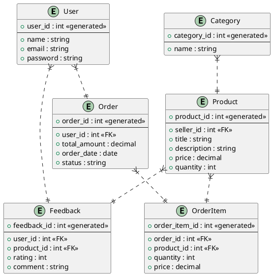

```plantuml

@startuml
entity "User" as e01 {
  + user_id : int <<generated>>
  --
  + name : string
  + email : string
  + password : string
}

entity "Product" as e02 {
  + product_id : int <<generated>>
  --
  + seller_id : int <<FK>>
  + title : string
  + description : string
  + price : decimal
  + quantity : int
}

entity "Category" as e03 {
  + category_id : int <<generated>>
  --
  + name : string
}

entity "Order" as e04 {
  + order_id : int <<generated>>
  --
  + user_id : int <<FK>>
  + total_amount : decimal
  + order_date : date
  + status : string
}

entity "OrderItem" as e05 {
  + order_item_id : int <<generated>>
  --
  + order_id : int <<FK>>
  + product_id : int <<FK>>
  + quantity : int
  + price : decimal
}

entity "Feedback" as e06 {
  + feedback_id : int <<generated>>
  --
  + user_id : int <<FK>>
  + product_id : int <<FK>>
  + rating : int
  + comment : string
}

e01 }|..|| e04
e02 }|..|| e05
e03 }|..|| e02
e04 }|..|| e05
e01 }|..|| e06
e02 }|..|| e06
@enduml

```